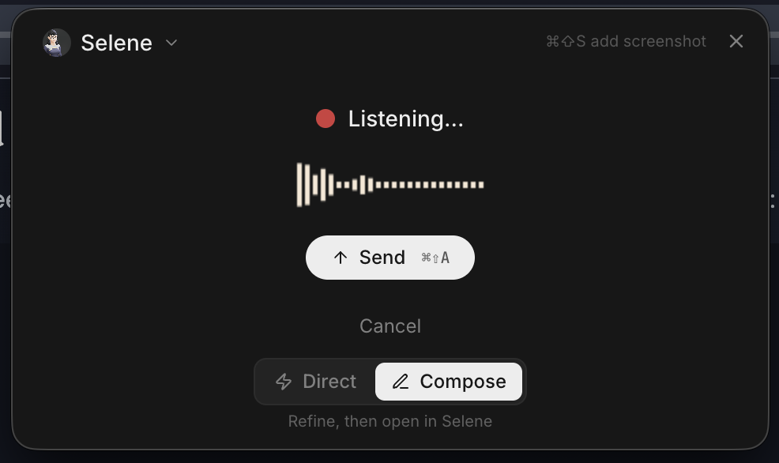
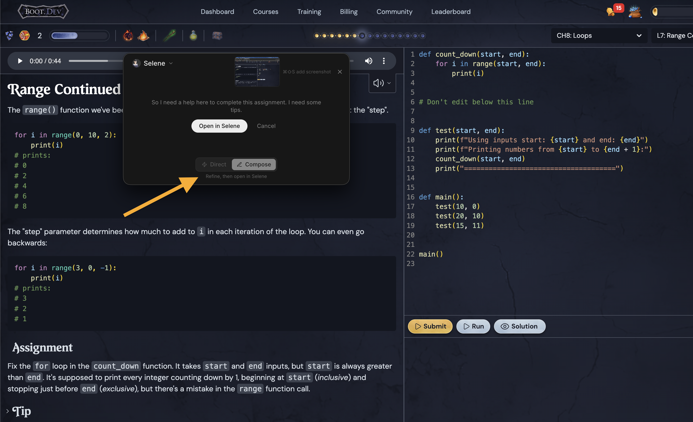

# Selene v0.3.2

> **Windows users:** The Windows build is up but largely untested — will give it a proper pass tomorrow. If you hit something, open an issue.

A major feature release. Voice capture gets a floating overlay that lives outside the main window, screen capture is now a first-class shortcut, BlackBox AI joins the provider lineup with 327 models, and multi-agent workflows get smarter folder sharing. Plus a full browser workspace overhaul and significantly better Windows support.

## Highlights

### 🎙️ Voice Overlay — Talk to your agent from anywhere
Press **Cmd+Shift+A** to open a compact floating overlay. Speak, get a response, done — without ever touching the main Selene window. The overlay stays on top of whatever you're working in.

- **Two modes:** *Direct* sends your voice straight to the AI and plays the response back as audio. *Compose* transcribes your voice and injects the text into the main chat composer so you can review before sending.
- **Pick your agent** from a compact dropdown right in the overlay — includes your most recently used agents.
- Press the same shortcut again to reset and start a new recording.
- The overlay syncs back to the main window after you send — open Selene and your conversation is right there.

### 📸 Screen Capture — Share your screen with one shortcut
Press **Cmd+Shift+S** to grab a screenshot and attach it directly to your active chat. No copy-paste, no file picker.

- Works while the overlay is open too — each press adds another screenshot to the current session.
- A live thumbnail shows what was captured, with a click-to-enlarge lightbox.
- **Auto-send countdown:** enable it and Selene will automatically send after a configurable delay once your voice transcription finishes.
- App exclusions: mark apps you don't want captured (passwords, banking, etc.) — they're skipped automatically.
- Privacy settings: control screenshot retention, preview-before-send, and which apps are excluded, all from a new onboarding flow the first time you enable screen capture.

### 🤖 BlackBox AI — 327 new models in one provider
BlackBox AI is now a fully supported provider. Add your API key in Settings and get access to 327 models including Claude, GPT-5, Gemini, DeepSeek, Qwen, and BlackBox's own web-search-native models.

- Full streaming, tool use, and web search support.
- Works everywhere models work: chat, deep research, agent defaults.

### 🗂️ Multi-Agent Workflow Folder Sharing
When agents work together in a workflow, they now automatically share access to each other's synced folders. If one agent adds or removes a folder, all workflow members see the update instantly — no manual re-configuration.

- Stopping a delegated sub-agent now properly cancels its background run and clears the task from the UI.
- Parallel delegations run truly concurrently instead of waiting for each other.

### 🌐 Browser Workspace — Full overhaul
The browser tab workspace has been rebuilt from the ground up:

- **Native look:** tabs adapt to your system theme. On macOS, the tab bar merges with the title bar (traffic light buttons included). On Windows, native min/max/close controls are in the right place.
- **Keyboard shortcuts:** Cmd+T (new tab), Cmd+W (close tab), Cmd+1–9 (jump to tab), Ctrl+Tab (cycle), Cmd+L (focus address bar), Cmd+K (open search), / (focus composer). A shortcut guide is one click away in the address bar.
- **Agent menu (⋯):** quick links and full agent management without leaving the browser workspace.
- Layout no longer shifts or jumps — composer is anchored to the bottom, animations are removed for snappier feel.

### 📎 Better File Attachments
Attach documents directly to chat — PDFs, Word files, spreadsheets, code files, and more. Files are routed through an improved parser that handles more formats reliably and preserves more content.

- Image attachments are now preserved correctly when using vision-capable models.

### 🔌 App Mockup Kit Plugin
A new built-in plugin for generating app UI mockups. Describe a screen, get a structured mockup back — useful for quickly visualizing ideas without leaving your agent workflow.

## Fixes

- Fixed command execution inheriting leaked internal environment variables that could cause tools to fail silently
- Fixed Windows path handling so git mode, file editing, and command execution all work correctly on Windows
- Fixed chat message count inflating incorrectly when live-prompt injections were active
- Fixed browser tab sessions losing their agent after being restored
- Fixed background runs not resuming correctly after being interrupted
- Fixed media files from tool outputs not displaying in chat
- Fixed image attachments being dropped when using vision models via Codex
- Fixed sub-agent delegation getting stuck in sequential mode instead of running in parallel
- Fixed ghost git branches appearing after cancelled operations
- Fixed the Shift+E shortcut for expanding tool results not working when the composer was focused
- Fixed overlay IPC crash and broken toggle shortcut
- Fixed HTTPS proxy not being respected for internal Electron routes
- Fixed composer and chat sidebar instability under rapid interaction
- Fixed streamed message content and attachments being lost on reconnect
- Fixed plan update rendering in multi-step agent tasks
- Fixed BlackBox AI models not showing up in the model picker after adding the API key

## Hotfixes (v0.3.2a)

Patch applied after initial release — included in updated installers.

- Fixed macOS tray showing a ghost icon by adding proper template icons
- Fixed Windows build logo and app tray icon not displaying
- Fixed BlackBoxAI model IDs retaining provider prefixes, causing model lookup failures
- Fixed deep research mode incorrectly falling back to the globally selected model instead of honoring session and agent model defaults
- Fixed mini overlay inheriting fullscreen state on macOS, expanding to fill the screen
- Fixed disabled plugins still firing lifecycle hooks on sub-agent delegations

## Hotfixes (v0.3.2b)

- Fixed macOS app disappearing from dock and Cmd+Tab after using voice overlay — closing or cancelling the overlay removed the app from the macOS app switcher entirely
- Fixed delegation tool results not appearing in chat UI or message history — sub-agent MCP responses were silently dropped due to SDK bridge timeout, missing summary cases, and empty expanded view
- Fixed reconnect leaving Claude Code tasks permanently stuck in active state after network outage
- Fixed settings not persisting for browser launch mode, TTS code blocks, and mini overlay preferences — six fields were accepted by the UI but discarded by the API save handler
- Fixed newly added plugins not taking effect in active agent sessions until app restart
- Fixed dark mode rendering Claude Code tool panels nearly invisible — containers, code blocks, diff colors, and status badges all lacked dark variants
- Fixed MCP servers with missing URL config crashing on connection instead of showing a "configuration required" state
- Fixed apply_patch rejecting valid absolute paths that resolve inside the workspace boundary
- Fixed interactive tool calls (plan mode, user questions) not rendering after page reload in background mode
- Fixed Shift+E shortcut for expanding tool results blocking normal typing of capital E — changed to Cmd/Ctrl+Shift+E
- Fixed TTS discarding buffered speech when encountering an unclosed code fence
- Fixed plugin import not including asset directories alongside plugin structure files
- Added plugin-declared MCP servers to the Settings panel with connection status, tool counts, and plugin attribution
- Added centralized macOS permission prompts for screen capture — actionable toasts with "Open System Settings" deep-links replace generic error messages

## Platform

- macOS (Apple Silicon + Intel) / Windows
- Package version: `0.3.2`
